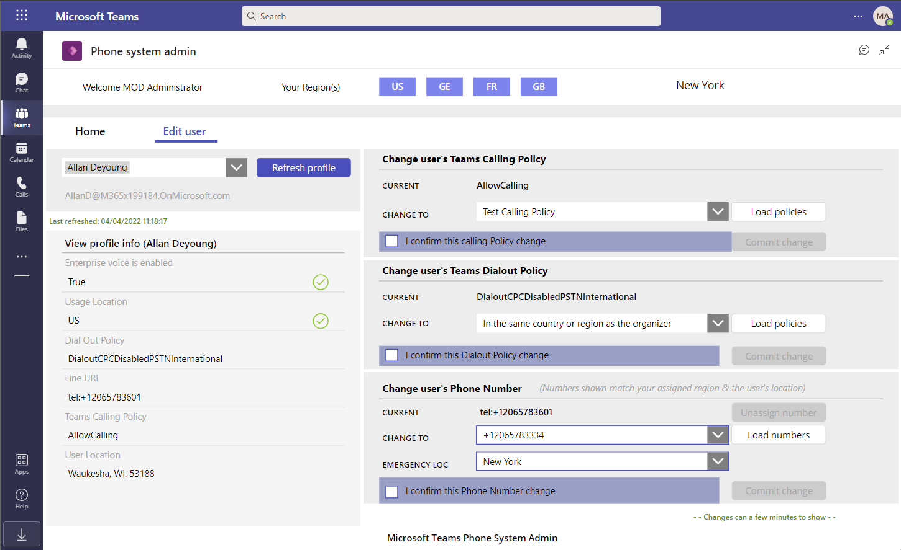
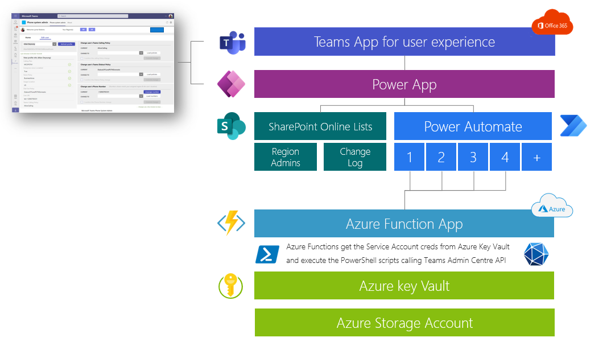

# Microsoft Teams Phone System admin app
A delegated Admin application for Calling Plans (PSTN) phone numbers management

## What's in it for you

Microsoft Teams provides an administration portal to manage the different telephony services for the organization. To access this portal, you need to assign one of the administrator roles defined [here](https://docs.microsoft.com/en-us/MicrosoftTeams/using-admin-roles). To manage the telephony system and assign telephone numbers or voice policies to users, the minimum required  role is "Teams Communications Administrator" - This role is then applied at the scope of the Azure AD tenant, meaning all users in your organization.

While this model works well well operations are managed centrally, it becomes more challenging when an organization needs to delegate these operations at local levels (e.g. per country) - This application provides an answer we a delegated management of the Telephony System based on the location of the users and permissions set for the delegated admins.

As of today, this application supports the following scenarios:
- Assign / Unassign PTSN numbers to a user
- Assing / update the Emergency location
- Assign / unassign voice policies to a user
- Assign / unassign calling policies to a user

Note: the solution only supports Calling Plans (aka PSTN) configuration  - Direct Routing is our of scope but the solution can be updated to support this scenario with minimum efforts using the appropriate PowerShell cmdlet.

The architecture of this solution can be adapted to support other scenarios that require delegated admin management of Teams phone system or any other feature accessible via PowerShell cmdlet or even MS Graph API. 

Here is the application running in Microsoft Teams

<!-- <p align="center">
    
</p> -->


## Solution overview

### High Level Design

<br>

<!-- <p align="center">
    
</p> -->


1. Users (central and local admins) access the application directly from Microsoft Teams - They are all members of an Office 365 Group with Central admins being the owners of the team and Local (aka delegated) admins are members. **Only Central admin can manage Local admin permissions**.
2. The user-interface is provided by a Power Apps. **The Power Apps is only accessbile to the members of the O365 Group**.
3. Local app settings are stored in a SharePoint List - This list is only accessible to Central admins - For each local admin, a list of country codes for delegated permissions is set (e.g. "US" / "FR" / "UK") - A Local admin can only manage users that have the "Usage Location" in Azure AD set to the their delegated country codes and can only manage telephone numbers with a matching "CityCode".
4. Actions validated on the Power Apps trigger a Power Automate flow - The role of the flow (one per API) is to **secure and log** all queries sent to the Teams Admin Center API's.
5. Azure KeyVault is used to securely store the secret and credentials required by the solution. With this design, secrets & credentials management of the "service account" and of the "service principal" can be delegated to a third party that is not an admin of the Team Telephony solution. 
6. Power Automate calls the Azure Function API providing the appropriate credentials.
7. The Azure Function get the "service account" credential that has the "Teams Communications Administrator" role and execute the PowerShell scripts
8. Azure AD conditional access checks the permissions and location of the request.


## How to deploy the solution
**Pre-requisites**

- Azure AD admin role to create a new user (a Service Account), assign roles and register a new application
- Azure AD Premium P1 license to enable Azure AD Conditional Access
- Azure Subscription and account with contributor role (to deploy resources)
- Power App license to deploy the application and Power Automate flows
- The following PowerShell modules needs to be installed prior to the execution of the PShell script:
   - Microsoft Teams - https://docs.microsoft.com/en-us/MicrosoftTeams/teams-powershell-install - Solution built and tested with v4.7.0
   - Azure Az - https://docs.microsoft.com/en-us/powershell/azure/install-az-ps - Solution built and tested with v7.3.2

Note: in this deployment, we assume that the same user has the appropriate permissions to deploy the resources on Azure, Power Platform and Azure AD. This is however not mandatory and the deployment can be split across these different roles and responsabilities within the organization.

**Step 1** - Create a Service Account in Azure AD

Role required: Azure AD admin

- Go to the [Azure AD portal](https://portal.azure.com/#blade/Microsoft_AAD_IAM/UsersManagementMenuBlade/MsGraphUsers) to manage users
- Add a new user (e.g. "Service Account Teams admin") and save the password
  
> Note: you'll need to reset this password the first time you use this account - Please connect to https://portal.azure.com with the user credentials and provide a new **complex** password - **Store this password in a secured location**

- Go under "assigned roles" and assign the following roles :
  - Directory readers - to read the user profiles
  - Teams communications administration - to manage the Teams telephony system
  - Skype for Business Administrator - to manage the dialout policies 

**Step 2** - Deploy the Azure resources

Roles required:
- Azure contributor
- Azure AD app registration autorized for members of the tenant (or specific Azure AD role assigned for app registration)

To execute this deployment step, you need to download the content of this repository on your local environment and run the PowerShell script under **.\Deployment\deploy.ps1**

- Download the content of this repository
- Execute the script deploy.ps1 with the following parameters

```PowerShell
$displayName          = 'Teams-Telephony-Manager' (default value)  
$rgName               = 'Teams-Telephony-Manager' (default value)  
$resourcePrefix       = 'teams-mng' (default value)  
$location             = 'westeurope' (default value)  
$serviceAccountUPN    = [UPN of the Service Account created in step 1]
$serviceAccountSecret = [Password of the Service Account created in step 1]    

.\deploy.ps1 -serviceAccountUPN $serviceAccountUPN -serviceAccountSecret $serviceAccountSecret
```

The deployment can take several minutes, including the warm-up time of the Azure Functions - At the end of the deployment, check the outputs that will be required to configure the deployment of the Power App and Azure AD Conditional Access 

A successful deployment should look like that (by default, the script runs 3 times)

```PowerShell
TriggerTime         WorkerId Duration StatusCode StatusDescription
-----------         -------- -------- ---------- -----------------
16/12/2021 16:42:06        2     6,93        200 OK
16/12/2021 16:42:08        1     8,65        200 OK
16/12/2021 16:42:09        3     9,38        200 OK

Deployment script terminated
Here are the information you ll need to deploy and configure the Power Application

API_URL       : 'https://teams-nnjqs.azurewebsites.net'
API_Code      : 'pujmFZfGxwqGXXXdddxLs2xXXXg2cMLhAUUE2Q=='
TenantID      : '153017a8-XXXX-XXXX-XXXX-463465842b89'
ClientID      : 'bad28fb5-XXXX-XXXX-XXXX-665886c2cbad'
Audience      : 'api://azfunc-bad28fb5-XXXX-XXXX-XXXX-665886c2cbad'
KeyVault_Name : 'az-vault-6cdgs'
AzFunctionIPs : '104.45.68.78,104.45.69.84,104.45.69.210,104.45.69.232,104.45.66.240,104.45.70.42,20.50.2.80'
```

**Step 3** - Deploy the Power App and flows

You can download the instruction to deploy the Power App in this [link](./Media/Phone-System-Admin-app-Power-Platform-deployment-guide.pdf).

The ZIP file mentionned in the document is available on this [link](./Packages/PowerApps/PhoneSystemSolution_1_0_1_8.zip).


>At the end of this step, the solution should work end-to-end - The next-steps are recommended but optional and are here to add more security into the solution using Azure AD authentication & controls.

**Step 4** - Activate Azure AD Conditional Access

You can enable Azure Conditional Access on the Service Account used by your Azure Function app and restrict the trusted IP's to the one used by Azure Function. Azure AD Conditional Access requires a Premium P1 license to be assigned - More info here on [license requirements](https://docs.microsoft.com/en-us/azure/active-directory/conditional-access/overview#license-requirements).

- Go to the [Azure AD portal](https://portal.azure.com/#blade/Microsoft_AAD_IAM/ConditionalAccessBlade/Overview) for Conditional Access management
- Select "Named location" and create a new IP range location
- Provide a name (e.g. "Azure Function app Teams admin") and mark the location as trusted location
- Enter all the IP addresses provided in the output of the deployment in step #2 (**AzFunctionIPs**) - Append a "/32" to each IP address
- Click on Create
- Go to Policies and then click on "Create new policy"
- Provide a name to your policy
- For the Assignments:
  - Users or workload identities > **Include** "Select users and groups" > check "User and groups" > search for your Service Account > Select
  - Cloud apps or actions > **Include** "All cloud apps"
  - Conditions > Locations > **Exclude**  "Selected locations" > "Azure Function app Teams admin" (created earlier)
- For the Access Controls:
  - Grant > Block access
- Enable policy
- Save to confirm and apply the changes

<p align="center">
    
</p>

Note: please go back to your Power App and check that the application still responds - You can also try to use the Service Principal credential from your local desktop and verity you can't login anymore.

**Step 5** - Share the application

You now have the application deployed in Teams and you need to provide access to "delegated admins" in your organization. To achieve that, we'll use the Office 365 group of the team where the Power Apps has been deployed.

1. All "delegated admins" needs to be invited in the team to access the Power App
2. Copy the name of the team where the app is installed - This is the name of your O365 group
3. You need to enable your O365 group to be used as a security group - For that, go to [Azure AD groups management blade](https://portal.azure.com/#blade/Microsoft_AAD_IAM/GroupsManagementMenuBlade/AllGroups) to get your O365 group ID and use the following Powershell command to enable security on this group.
   ```Powershell
     Set-AzureADMSGroup -Id [Office365_Group_ID] -SecurityEnabled $true
   ```

4. Go to the [Azure portal](https://portal.azure.com) and then to the Azure KeyVault deployed in this solution
   - Select "Access policies > Add Access Policy 
   - Under "Secret Permissions" select "GET" and "LIST"
   - Click on "Select Principal" and enter the name of your O365 group and press "Select"
   - Click "Add" to validate this policy
   - Click "Save" to commit the new configuration
5. Go to the [Power Apps portal](https://make.powerapps.com/) and then select your Power Apps
   - Select the option menu and then "Share" - More info [here](https://docs.microsoft.com/en-us/powerapps/maker/canvas-apps/share-app)
   - Search for the O365 team group that is security enabled
   - Click on "Share" to confirm the new permission
6. The 1st your users will access the Power App in Teams, they will need to consent to use the 3 connectors (SharePoint, Office365 and Azure KeyVault) - For Azure KeyVault, they need to provide the KeyVault name that you get from the deployment of the Azure resources (e.g. az-vault-6cdgs)


## Operations

This solution is built on the Microsoft Power Platform (SaaS) and Microsoft Azure using PaaS services - The benefit of these services is that Microsoft is in charge of the infrastructure layer and this solution includes some level of logs to track changes and facilitate the troubleshooting as well. However, you're still responsible for the management of this application with the following recommendations:
- Implement [Azure Monitor](https://docs.microsoft.com/en-us/azure/azure-monitor/overview) and [Application Insights](https://docs.microsoft.com/en-us/azure/azure-monitor/app/app-insights-overview) to monitor the Azure services and application.
- Subscribe to service updates an information for Office 365, Power Platform and Azure via the official channels including [Microsoft 365 Message Center](https://docs.microsoft.com/en-us/microsoft-365/admin/manage/message-center) and [Azure Service Health](https://docs.microsoft.com/en-us/azure/service-health/overview)
- Subscribe to [Microsoft Teams modules](https://www.powershellgallery.com/profiles/MicrosoftTeams/) updates in the PowerShell gallery

## Costs Estimates

This is a costs estimates based on the public pricelist of March 2022.
They do not include the costs for Office 365 & Microsoft Teams.

**All prices are provided for information only.**

| Service  | Estimated usage  | Unit price  | Estimated cost / month  |
|---|---|---|---|
| Power Platform  | 20 admins (Premium connector) | $5 per user/app/month  | $100  |
| Azure App Service plan  | 1 plan (Basic B1) for all Azure functions | $54.75 per plan/month | $55  |
| Azure (other services)  | storage and keyvault request  | based on capacity (GB) & # requests  | <$1  |
| Azure AD CA | 1 P1 license | $6 peruser/month | $6 |
| Total estimated ||| $162 |


- [Power Apps pricing](https://powerapps.microsoft.com/en-us/pricing/)
- [Azure Pricing calculator](https://azure.microsoft.com/en-us/pricing/calculator/)
- [Azure AD pricing](https://azure.microsoft.com/en-us/pricing/details/active-directory/)

## Contributing

This project welcomes contributions and suggestions.  Most contributions require you to agree to a
Contributor License Agreement (CLA) declaring that you have the right to, and actually do, grant us
the rights to use your contribution. For details, visit https://cla.opensource.microsoft.com.

When you submit a pull request, a CLA bot will automatically determine whether you need to provide
a CLA and decorate the PR appropriately (e.g., status check, comment). Simply follow the instructions
provided by the bot. You will only need to do this once across all repos using our CLA.

This project has adopted the [Microsoft Open Source Code of Conduct](https://opensource.microsoft.com/codeofconduct/).
For more information see the [Code of Conduct FAQ](https://opensource.microsoft.com/codeofconduct/faq/) or
contact [opencode@microsoft.com](mailto:opencode@microsoft.com) with any additional questions or comments.


## Trademarks

This project may contain trademarks or logos for projects, products, or services. Authorized use of Microsoft
trademarks or logos is subject to and must follow
[Microsoft's Trademark & Brand Guidelines](https://www.microsoft.com/en-us/legal/intellectualproperty/trademarks/usage/general).
Use of Microsoft trademarks or logos in modified versions of this project must not cause confusion or imply Microsoft sponsorship.
Any use of third-party trademarks or logos are subject to those third-party's policies.

## Reference documentation

### Microsoft Teams admin 
- [User provisioning end-state for various PSTN connectivity options](https://docs.microsoft.com/en-us/MicrosoftTeams/direct-routing-migrating#user-provisioning-end-state-for-various-pstn-connectivity-options)
- [Product names and service plan identifiers for licensing](https://docs.microsoft.com/en-us/azure/active-directory/enterprise-users/licensing-service-plan-reference)
- [See all telephone numbers in your organization](https://docs.microsoft.com/en-us/microsoftteams/see-a-list-of-phone-numbers-in-your-organization)
- [Assign, change, or remove a phone number for a user](https://docs.microsoft.com/en-us/microsoftteams/assign-change-or-remove-a-phone-number-for-a-user)
- [Outbound calling restriction policies for Audio Conferencing and user PSTN calls](https://docs.microsoft.com/en-us/microsoftteams/outbound-calling-restriction-policies)

### Microsoft Teams PowerShell module
- [PowerShell Gallery | MicrosoftTeams](https://www.powershellgallery.com/profiles/MicrosoftTeams/)

### Azure
- [Azure Functions PowerShell developer guide](https://docs.microsoft.com/en-us/azure/azure-functions/functions-reference-powershell)
